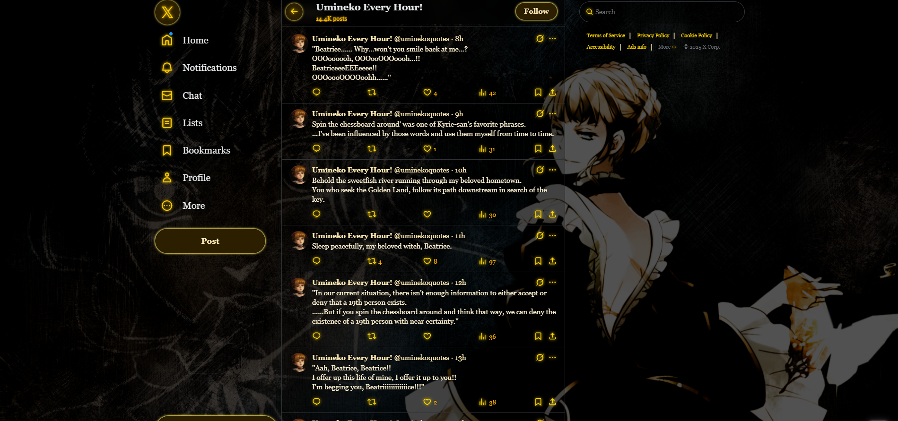
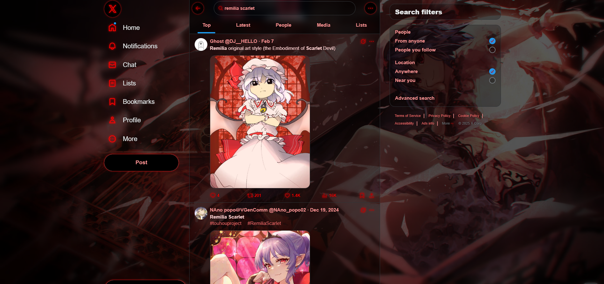

# MIZU TWITTER
**Mizu Twitter** is a browser extension designed primarily for anime fans and anyone seeking a better Twitter experience. It enhances Twitter with anime-inspired themes and customization options, hides unnecessary or distracting interface elements, and helps reduce exposure to toxic content such as rage-bait posts and political content.

## Theme Examples

  
   
  <em>Umineko Beatrice theme</em>

  
   
  <em>Remilia Scarlet theme</em>

  
   
  <em>Matrix theme</em>

## Key Features
- **Distraction Removal**: Hide unnecessary elements like Grok, Twitter Premium, trending topics and other clutter.
- **Political Content Filter**: Automatically hides politically-driven tweets for users who prefer to avoid politics on Twitter *(not implemented yet).*
- **Customizable Themes**: Multiple themes available to personalize Twitter’s appearance according to your taste.
- **Simple Settings**: Every feature can be enabled or disabled via the extension popup.

## Themes
**Available:**
- Default Twitter (Black)
- Matrix (Lime)
- Touhou - Remilia Scarlet (Dark red)
- Umineko - Beatrice (Gold)
 
**Planned:**
- Cyberpunk theme
- Amethyst theme
- Touhou - Sanae Kochiya (green)
- Touhou - Yuuka Kazami (dark green)
- Touhou - Cirno (light-blue)
- Touhou - Okuu (dark yellow)
- Higurashi - Rena (dark orange)
- Umineko - Bernkastel (purple)
- Chainsaw Man (dark orange)
- Initial D (dark gray)
- Umamusume
...

## Contributing
Contributions are welcome! Feel free to suggest ideas, report bugs or improve the extension via pull requests.

## License
MIT License