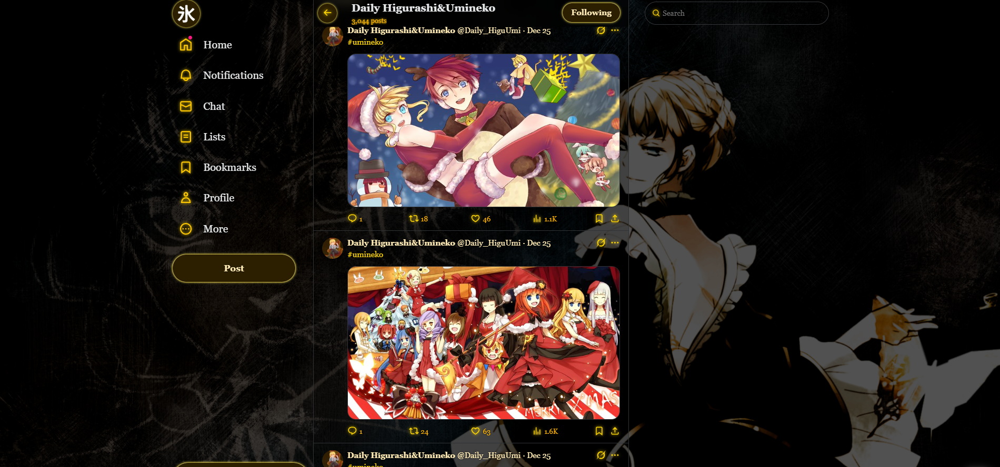
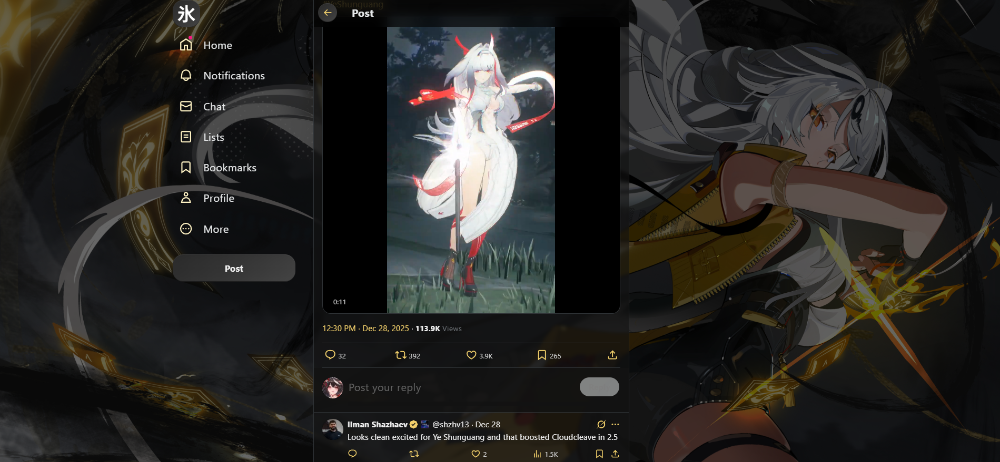

# MIZU TWITTER
**Mizu Twitter** is a browser extension designed for anime fans and anyone looking for a cleaner, more enjoyable Twitter experience. It enhances Twitter with anime themes and customization options, hides unnecessary or distracting interface elements, and helps reduce exposure to algorithmically amplified political content. **Mizu Twitter** aims to bring a bit of that old internet spirit back, putting you in control so you can enjoy Twitter the way it was meant to be-fun, personal, and stress-free.

## Key Features
- **Theme Customization**: Lets you switch between cozy anime-inspired themes.
- **Distraction-Free Interface**: Optionally hides sidebars, communities, Grok/AI suggestions, premium features, and other clutter.
- **Political Content Filtering**: Automatically hides tweets containing political words, phrases, or figures.
- **Simple Settings**: Every feature can be enabled or disabled via the extension popup.
- **Persistent & Lightweight**: Saves settings locally and runs efficiently without slowing down Twitter/X.

## Theme Examples
<p align="center">
  
  <br>
  <em>Touhou - Yuyuko theme</em>
</p>

<p align="center">
  
  <br>
  <em>Umineko - Beatrice theme</em>
</p>

<p align="center">
  
  <br>
  <em>Zenless Zone Zero - Yi Xuan theme</em>
</p>

<p align="center">
  
  <br>
  <em>Matrix theme</em>
</p>

## Installation
You can download the extension on the Chrome Web Store: [Download](https://chromewebstore.google.com/detail/mizu-twitter/apebifiehlkceokaifbboakijidojhnp)
<br>
The extension is also compatible with Firefox
<br><br>
__**Here's how you can download the extension without using the Chrome Web Store:**__
### 1. Download the latest release on GitHub
1. Download here: [Download ZIP](https://github.com/Nyuke235/Mizu-Twitter/releases/download/v0.2/MizuTwitter.zip)
2. Extract the ZIP file on your computer.

### 2. Open your Extensions Page
1. Open your browser.
2. Go to:
```
chrome://extensions/
```
or `brave://extensions/` depending on your browser

3. Toggle the Developer mode switch in the top-right corner.

### 3. Load the Unpacked Extension
1. Click "Load unpacked".
2. Navigate to the `MizuTwitter/` folder (the folder containing manifest.json) and select it.
3. The extension should appear in the toolbar.

### 4. Test the Extension
1. Visit Twitter/X and open the extension popup.
2. Toggle features like Filter Politics or Themes to make sure they work.

## Planned
- Way more themes
- Custom CSS theme
- Custom filter
- Enhanced political filtering
- Firefox support


## Contributing
Contributions are welcome! Feel free to suggest ideas, report bugs or improve the extension via pull requests.

## License
MIT License