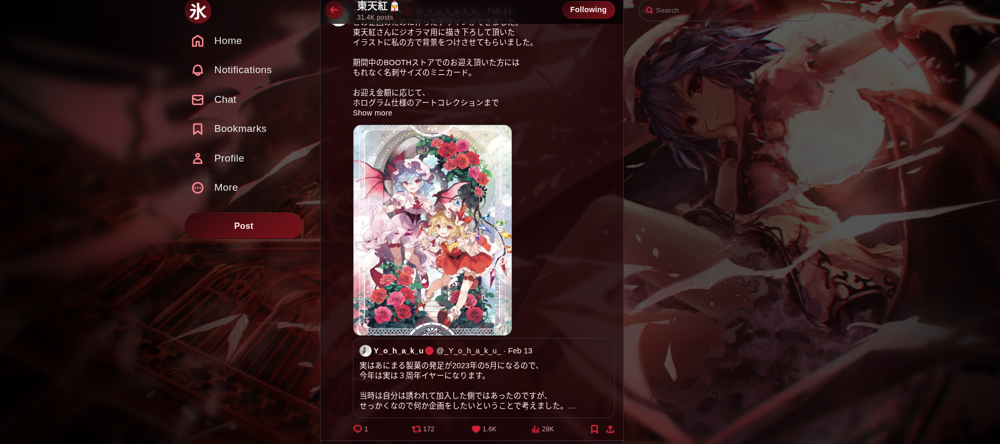
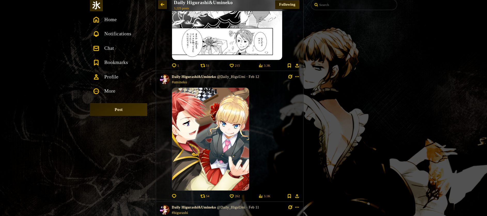
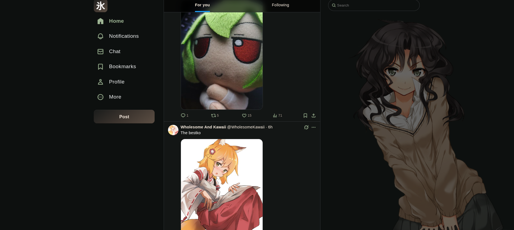

# MIZU TWITTER

**Mizu Twitter** is a browser extension for anime fans and anyone who wants a cleaner Twitter experience. It brings anime-inspired themes, hides distracting UI clutter, and reduces exposure to algorithmically amplified political content, putting you back in control of your feed.

## Features

- **Anime Themes**: Switch between 20+ hand-crafted themes, each with a unique color palette, background art, and visual style.
- **Distraction-Free UI**: Optionally hide sidebars, Communities, Grok/AI suggestions, Premium upsells, trending topics, and other noise.
- **Political Content Filter**: Automatically hides tweets containing political keywords, phrases, or public figures.
- **Simple Toggles**: Every feature is independently switchable from the extension popup.
- **Lightweight & Persistent**: Settings are saved locally via browser storage.

## Theme Examples

  
   
  <em>Touhou - Remilia Scarlet</em>

  
   
  <em>Umineko - Beatrice</em>

  
   
  <em>Amagami - Kaoru Tanamachi</em>

## Installation

The extension is available on the **Chrome Web Store** and on **Firefox Add-ons**:

| Browser | Link |
|---|---|
| Chrome / Brave / Edge | [Chrome Web Store](https://chromewebstore.google.com/detail/mizu-twitter/apebifiehlkceokaifbboakijidojhnp) |
| Firefox | [Firefox Add-ons](https://addons.mozilla.org/en-US/firefox/addon/mizu-twitter/) |

### Manual Installation

1. Download the [latest release ZIP](https://github.com/Nyuke235/Mizu-Twitter/releases/latest) and extract it.
2. Open your browser's extensions page:
   - Chrome : `chrome://extensions/`
   - Brave : `brave://extensions/`
   - Edge: `edge://extensions/`
3. Enable **Developer mode** (top-right toggle).
4. Click **Load unpacked** and select the extracted `MizuTwitter/` folder.
5. The Mizu icon will appear in your toolbar. Visit Twitter/X to try it out.

## Available Themes

**Solid color themes**
| Theme | Style |
|---|---|
| Default Twitter | Matches Twitter's default dark look |
| Matrix | Green-on-black terminal with scanlines |
| Amber CRT | Warm amber terminal with scanlines |
| Deep Sea | Dark ocean blues with a bioluminescent glow |

**Anime / character themes**
| Theme | Art by |
|---|---|
| Amagami - Kaoru Tanamachi | Char (2V 26) |
| Blue Archive - Tsukatsuki Rio | ZOMSAUCE |
| Date A Live - Tokisaki Kurumi | mmrailgun |
| Fate - Jeanne d'Arc Alter | Bison Cangshu |
| Hatsune Miku | Popuru |
| Higurashi - Rena | - |
| Madoka Magica - Homura | Polychromatic |
| Steins;Gate - Kurisu Makise | Pat86 |
| Touhou - Koishi Komeiji | eps3rd |
| Touhou - Sakuya Izayoi | Shideoukami |
| Touhou - Remilia Scarlet | MISSILE228 |
| Touhou - Yuyuko Saigyouji | Kitairoha |
| Umamusume - Manhattan Cafe | Flippy (Cripine111) |
| Umineko - Beatrice | Pat86 |
| Umineko - Bernkastel | Mushi024 |
| Zenless Zone Zero - Yi Xuan | Daymera |

## Contributing

Contributions are welcome — bug reports, feature suggestions, new themes, or pull requests. Feel free to open an issue or PR on GitHub.

## License

MIT License
